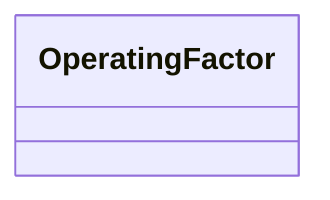

---
search:
  boost: 10.0
---

# Class: OperatingFactor 


_A 'factor' affecting the operation and outcomes of the technology_


<div data-search-exclude markdown="1">


URI: [tech:OperatingFactor](https://w3id.org/lmodel/dpv/tech/OperatingFactor)





<!-- no inheritance hierarchy -->

## Class Properties

| Property | Value |
| --- | --- |
| Class URI | [tech:OperatingFactor](https://w3id.org/lmodel/dpv/tech/OperatingFactor) |


## Slots

| Name | Cardinality and Range | Description | Inheritance |
| ---  | --- | --- | --- |


## In Subsets


* [TechSubset](TechSubset.md)


## Aliases


* Operating Factor


## Comments

* Examples of operating factor could be equipment characteristics,
lighting conditions for camera operations, connectivity for
communications. This helps indicate whether specific factors are ideal
i.e. they will give the best performance, or are problematic i.e. they
will cause issues


## Identifier and Mapping Information


### Annotations

| property | value |
| --- | --- |
| dct_source | Model Cards by Mitchell et al. (2019) |
| upstream_iri | https://w3id.org/dpv/tech/owl#OperatingFactor |
| dpv_extension_slug | tech |


### Schema Source


* from schema: https://w3id.org/lmodel/dpv/tech


## Mappings

| Mapping Type | Mapped Value |
| ---  | ---  |
| self | tech:OperatingFactor |
| native | tech:OperatingFactor |
| exact | dpv_tech:OperatingFactor, dpv_tech_owl:OperatingFactor |


## LinkML Source

<!-- TODO: investigate https://stackoverflow.com/questions/37606292/how-to-create-tabbed-code-blocks-in-mkdocs-or-sphinx -->

### Direct

<details>
```yaml
name: OperatingFactor
annotations:
  dct_source:
    tag: dct_source
    value: Model Cards by Mitchell et al. (2019)
  upstream_iri:
    tag: upstream_iri
    value: https://w3id.org/dpv/tech/owl#OperatingFactor
  dpv_extension_slug:
    tag: dpv_extension_slug
    value: tech
description: A 'factor' affecting the operation and outcomes of the technology
comments:
- 'Examples of operating factor could be equipment characteristics,

  lighting conditions for camera operations, connectivity for

  communications. This helps indicate whether specific factors are ideal

  i.e. they will give the best performance, or are problematic i.e. they

  will cause issues'
in_subset:
- tech_subset
from_schema: https://w3id.org/lmodel/dpv/tech
aliases:
- Operating Factor
exact_mappings:
- dpv_tech:OperatingFactor
- dpv_tech_owl:OperatingFactor
class_uri: tech:OperatingFactor

```
</details>

### Induced

<details>
```yaml
name: OperatingFactor
annotations:
  dct_source:
    tag: dct_source
    value: Model Cards by Mitchell et al. (2019)
  upstream_iri:
    tag: upstream_iri
    value: https://w3id.org/dpv/tech/owl#OperatingFactor
  dpv_extension_slug:
    tag: dpv_extension_slug
    value: tech
description: A 'factor' affecting the operation and outcomes of the technology
comments:
- 'Examples of operating factor could be equipment characteristics,

  lighting conditions for camera operations, connectivity for

  communications. This helps indicate whether specific factors are ideal

  i.e. they will give the best performance, or are problematic i.e. they

  will cause issues'
in_subset:
- tech_subset
from_schema: https://w3id.org/lmodel/dpv/tech
aliases:
- Operating Factor
exact_mappings:
- dpv_tech:OperatingFactor
- dpv_tech_owl:OperatingFactor
class_uri: tech:OperatingFactor

```
</details></div>