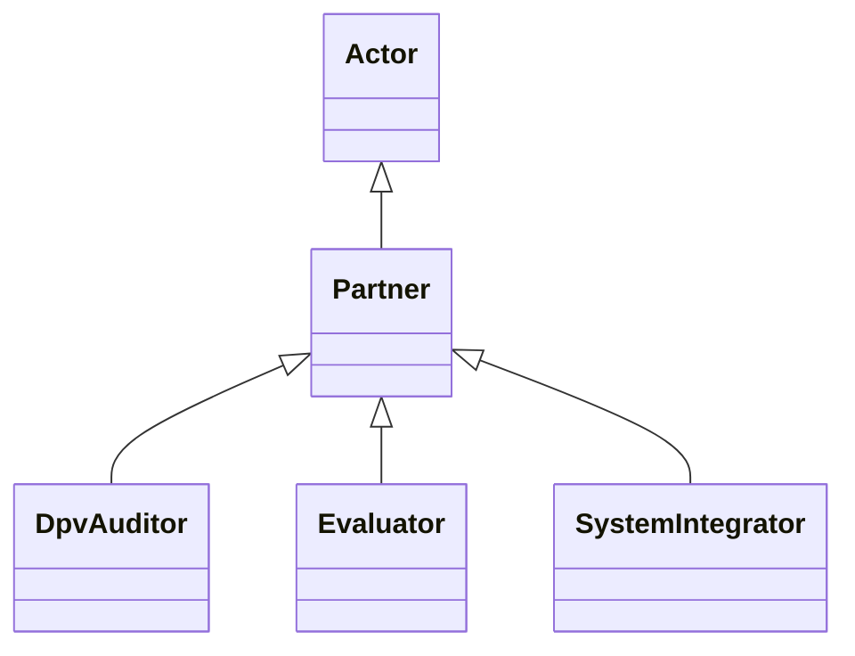

---
search:
  boost: 10.0
---

# Class: Partner 


_Actor that provides services in the context of Technology_


<div data-search-exclude markdown="1">


URI: [tech:Partner](https://w3id.org/lmodel/dpv/tech/Partner)





## Inheritance
* [Actor](Actor.md)
    * **Partner**
        * [DpvAuditor](DpvAuditor.md) [ [Actor](Actor.md)]
        * [Evaluator](Evaluator.md) [ [Actor](Actor.md)]
        * [SystemIntegrator](SystemIntegrator.md) [ [Actor](Actor.md)]


## Class Properties

| Property | Value |
| --- | --- |
| Class URI | [tech:Partner](https://w3id.org/lmodel/dpv/tech/Partner) |


## Slots

| Name | Cardinality and Range | Description | Inheritance |
| ---  | --- | --- | --- |


## In Subsets


* [TechSubset](TechSubset.md)


## Aliases


* Partner


## Comments

* "Partner" is a vague term and should not be used - instead the more
specific terms provided in this vocabulary should be used. Partner
refers to entities that provide services for the technology (as opposed
to for using the technology) - for example to further develop or refine
it, or to test or audit it.


## Identifier and Mapping Information


### Annotations

| property | value |
| --- | --- |
| dct_source | ISO/IEC 22989:2022 |
| upstream_iri | https://w3id.org/dpv/tech/owl#Partner |
| dpv_extension_slug | tech |


### Schema Source


* from schema: https://w3id.org/lmodel/dpv/tech


## Mappings

| Mapping Type | Mapped Value |
| ---  | ---  |
| self | tech:Partner |
| native | tech:Partner |
| exact | dpv_tech:Partner, dpv_tech_owl:Partner |


## LinkML Source

<!-- TODO: investigate https://stackoverflow.com/questions/37606292/how-to-create-tabbed-code-blocks-in-mkdocs-or-sphinx -->

### Direct

<details>
```yaml
name: Partner
annotations:
  dct_source:
    tag: dct_source
    value: ISO/IEC 22989:2022
  upstream_iri:
    tag: upstream_iri
    value: https://w3id.org/dpv/tech/owl#Partner
  dpv_extension_slug:
    tag: dpv_extension_slug
    value: tech
description: Actor that provides services in the context of Technology
comments:
- '"Partner" is a vague term and should not be used - instead the more

  specific terms provided in this vocabulary should be used. Partner

  refers to entities that provide services for the technology (as opposed

  to for using the technology) - for example to further develop or refine

  it, or to test or audit it.'
in_subset:
- tech_subset
from_schema: https://w3id.org/lmodel/dpv/tech
aliases:
- Partner
exact_mappings:
- dpv_tech:Partner
- dpv_tech_owl:Partner
is_a: Actor
class_uri: tech:Partner

```
</details>

### Induced

<details>
```yaml
name: Partner
annotations:
  dct_source:
    tag: dct_source
    value: ISO/IEC 22989:2022
  upstream_iri:
    tag: upstream_iri
    value: https://w3id.org/dpv/tech/owl#Partner
  dpv_extension_slug:
    tag: dpv_extension_slug
    value: tech
description: Actor that provides services in the context of Technology
comments:
- '"Partner" is a vague term and should not be used - instead the more

  specific terms provided in this vocabulary should be used. Partner

  refers to entities that provide services for the technology (as opposed

  to for using the technology) - for example to further develop or refine

  it, or to test or audit it.'
in_subset:
- tech_subset
from_schema: https://w3id.org/lmodel/dpv/tech
aliases:
- Partner
exact_mappings:
- dpv_tech:Partner
- dpv_tech_owl:Partner
is_a: Actor
class_uri: tech:Partner

```
</details></div>