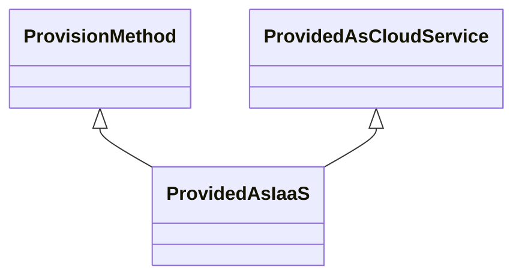

---
search:
  boost: 10.0
---

# Class: ProvidedAsIaaS 


_Technology provided as a cloud service consisting of managed_

_infrastructure resources_


<div data-search-exclude markdown="1">


URI: [tech:ProvidedAsIaaS](https://w3id.org/lmodel/dpv/tech/ProvidedAsIaaS)





## Inheritance
* [ProvisionMethod](ProvisionMethod.md)
    * [ProvidedAsService](ProvidedAsService.md)
        * [ProvidedAsCloudService](ProvidedAsCloudService.md) [ [ProvisionMethod](ProvisionMethod.md)]
            * **ProvidedAsIaaS** [ [ProvisionMethod](ProvisionMethod.md)]


## Class Properties

| Property | Value |
| --- | --- |
| Class URI | [tech:ProvidedAsIaaS](https://w3id.org/lmodel/dpv/tech/ProvidedAsIaaS) |


## Slots

| Name | Cardinality and Range | Description | Inheritance |
| ---  | --- | --- | --- |


## In Subsets


* [TechSubset](TechSubset.md)


## Aliases


* Provided as Infrastructure as a Service (IaaS)Provision


## Identifier and Mapping Information


### Annotations

| property | value |
| --- | --- |
| upstream_iri | https://w3id.org/dpv/tech/owl#ProvidedAsIaaS |
| dpv_extension_slug | tech |


### Schema Source


* from schema: https://w3id.org/lmodel/dpv/tech


## Mappings

| Mapping Type | Mapped Value |
| ---  | ---  |
| self | tech:ProvidedAsIaaS |
| native | tech:ProvidedAsIaaS |
| exact | dpv_tech:ProvidedAsIaaS, dpv_tech_owl:ProvidedAsIaaS |


## LinkML Source

<!-- TODO: investigate https://stackoverflow.com/questions/37606292/how-to-create-tabbed-code-blocks-in-mkdocs-or-sphinx -->

### Direct

<details>
```yaml
name: ProvidedAsIaaS
annotations:
  upstream_iri:
    tag: upstream_iri
    value: https://w3id.org/dpv/tech/owl#ProvidedAsIaaS
  dpv_extension_slug:
    tag: dpv_extension_slug
    value: tech
description: 'Technology provided as a cloud service consisting of managed

  infrastructure resources'
in_subset:
- tech_subset
from_schema: https://w3id.org/lmodel/dpv/tech
aliases:
- Provided as Infrastructure as a Service (IaaS)Provision
exact_mappings:
- dpv_tech:ProvidedAsIaaS
- dpv_tech_owl:ProvidedAsIaaS
is_a: ProvidedAsCloudService
mixins:
- ProvisionMethod
class_uri: tech:ProvidedAsIaaS

```
</details>

### Induced

<details>
```yaml
name: ProvidedAsIaaS
annotations:
  upstream_iri:
    tag: upstream_iri
    value: https://w3id.org/dpv/tech/owl#ProvidedAsIaaS
  dpv_extension_slug:
    tag: dpv_extension_slug
    value: tech
description: 'Technology provided as a cloud service consisting of managed

  infrastructure resources'
in_subset:
- tech_subset
from_schema: https://w3id.org/lmodel/dpv/tech
aliases:
- Provided as Infrastructure as a Service (IaaS)Provision
exact_mappings:
- dpv_tech:ProvidedAsIaaS
- dpv_tech_owl:ProvidedAsIaaS
is_a: ProvidedAsCloudService
mixins:
- ProvisionMethod
class_uri: tech:ProvidedAsIaaS

```
</details></div>