---
search:
  boost: 10.0
---

# Class: ProvisionMethod 


_Method associated with provision or use of technology_


<div data-search-exclude markdown="1">


URI: [tech:ProvisionMethod](https://w3id.org/lmodel/dpv/tech/ProvisionMethod)

```mermaid
 classDiagram
    class ProvisionMethod
    click ProvisionMethod href "../ProvisionMethod/"
      ProvisionMethod <|-- ProvidedAsAlgorithmic
        click ProvidedAsAlgorithmic href "../ProvidedAsAlgorithmic/"
      ProvisionMethod <|-- ProvidedAsCaaS
        click ProvidedAsCaaS href "../ProvidedAsCaaS/"
      ProvisionMethod <|-- ProvidedAsCloudService
        click ProvidedAsCloudService href "../ProvidedAsCloudService/"
      ProvisionMethod <|-- ProvidedAsComponent
        click ProvidedAsComponent href "../ProvidedAsComponent/"
      ProvisionMethod <|-- ProvidedAsFixedUse
        click ProvidedAsFixedUse href "../ProvidedAsFixedUse/"
      ProvisionMethod <|-- ProvidedAsGoods
        click ProvidedAsGoods href "../ProvidedAsGoods/"
      ProvisionMethod <|-- ProvidedAsHybridCloudService
        click ProvidedAsHybridCloudService href "../ProvidedAsHybridCloudService/"
      ProvisionMethod <|-- ProvidedAsIaaS
        click ProvidedAsIaaS href "../ProvidedAsIaaS/"
      ProvisionMethod <|-- ProvidedAsMBaaS
        click ProvidedAsMBaaS href "../ProvidedAsMBaaS/"
      ProvisionMethod <|-- ProvidedAsPaaS
        click ProvidedAsPaaS href "../ProvidedAsPaaS/"
      ProvisionMethod <|-- ProvidedAsPrivateCloudService
        click ProvidedAsPrivateCloudService href "../ProvidedAsPrivateCloudService/"
      ProvisionMethod <|-- ProvidedAsProduct
        click ProvidedAsProduct href "../ProvidedAsProduct/"
      ProvisionMethod <|-- ProvidedAsPublicCloudService
        click ProvidedAsPublicCloudService href "../ProvidedAsPublicCloudService/"
      ProvisionMethod <|-- ProvidedAsSaaS
        click ProvidedAsSaaS href "../ProvidedAsSaaS/"
      ProvisionMethod <|-- ProvidedAsServerlessComputing
        click ProvidedAsServerlessComputing href "../ProvidedAsServerlessComputing/"
      ProvisionMethod <|-- ProvidedAsService
        click ProvidedAsService href "../ProvidedAsService/"
      ProvisionMethod <|-- ProvidedAsSubscription
        click ProvidedAsSubscription href "../ProvidedAsSubscription/"
      ProvisionMethod <|-- ProvidedAsSystem
        click ProvidedAsSystem href "../ProvidedAsSystem/"
      
      
```





## Inheritance
* **ProvisionMethod**
    * [ProvidedAsAlgorithmic](ProvidedAsAlgorithmic.md)
    * [ProvidedAsComponent](ProvidedAsComponent.md)
    * [ProvidedAsFixedUse](ProvidedAsFixedUse.md)
    * [ProvidedAsGoods](ProvidedAsGoods.md)
    * [ProvidedAsProduct](ProvidedAsProduct.md)
    * [ProvidedAsService](ProvidedAsService.md)
    * [ProvidedAsSubscription](ProvidedAsSubscription.md)
    * [ProvidedAsSystem](ProvidedAsSystem.md)


## Class Properties

| Property | Value |
| --- | --- |
| Class URI | [tech:ProvisionMethod](https://w3id.org/lmodel/dpv/tech/ProvisionMethod) |


## Slots

| Name | Cardinality and Range | Description | Inheritance |
| ---  | --- | --- | --- |


## In Subsets


* [TechSubset](TechSubset.md)


## Aliases


* Provision Method


## Identifier and Mapping Information


### Annotations

| property | value |
| --- | --- |
| upstream_iri | https://w3id.org/dpv/tech/owl#ProvisionMethod |
| dpv_extension_slug | tech |


### Schema Source


* from schema: https://w3id.org/lmodel/dpv/tech


## Mappings

| Mapping Type | Mapped Value |
| ---  | ---  |
| self | tech:ProvisionMethod |
| native | tech:ProvisionMethod |
| exact | dpv_tech:ProvisionMethod, dpv_tech_owl:ProvisionMethod |


## LinkML Source

<!-- TODO: investigate https://stackoverflow.com/questions/37606292/how-to-create-tabbed-code-blocks-in-mkdocs-or-sphinx -->

### Direct

<details>
```yaml
name: ProvisionMethod
annotations:
  upstream_iri:
    tag: upstream_iri
    value: https://w3id.org/dpv/tech/owl#ProvisionMethod
  dpv_extension_slug:
    tag: dpv_extension_slug
    value: tech
description: Method associated with provision or use of technology
in_subset:
- tech_subset
from_schema: https://w3id.org/lmodel/dpv/tech
aliases:
- Provision Method
exact_mappings:
- dpv_tech:ProvisionMethod
- dpv_tech_owl:ProvisionMethod
class_uri: tech:ProvisionMethod

```
</details>

### Induced

<details>
```yaml
name: ProvisionMethod
annotations:
  upstream_iri:
    tag: upstream_iri
    value: https://w3id.org/dpv/tech/owl#ProvisionMethod
  dpv_extension_slug:
    tag: dpv_extension_slug
    value: tech
description: Method associated with provision or use of technology
in_subset:
- tech_subset
from_schema: https://w3id.org/lmodel/dpv/tech
aliases:
- Provision Method
exact_mappings:
- dpv_tech:ProvisionMethod
- dpv_tech_owl:ProvisionMethod
class_uri: tech:ProvisionMethod

```
</details></div>