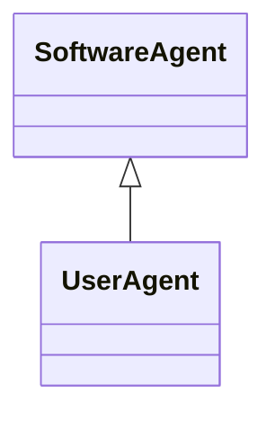

---
search:
  boost: 10.0
---

# Class: UserAgent 


_A software agent that represents a person (i.e. a human)_


<div data-search-exclude markdown="1">


URI: [tech:UserAgent](https://w3id.org/lmodel/dpv/tech/UserAgent)





## Inheritance
* [SoftwareAgent](SoftwareAgent.md) [ [Software](Software.md)]
    * **UserAgent**


## Class Properties

| Property | Value |
| --- | --- |
| Class URI | [tech:UserAgent](https://w3id.org/lmodel/dpv/tech/UserAgent) |


## Slots

| Name | Cardinality and Range | Description | Inheritance |
| ---  | --- | --- | --- |


## In Subsets


* [TechSubset](TechSubset.md)


## Aliases


* User-Agent


## Comments

* User Agent as defined here specifically represents software agents that
represent humans, whether directly or indirectly, based on the
well-defined use of this term in Web interactions. Software that is not
representing a human but which acts or declares itself as a user agent
is termed as 'user agent spoofing' (see
https://developer.mozilla.org/en-US/docs/Glossary/User_agent)


## Identifier and Mapping Information


### Annotations

| property | value |
| --- | --- |
| upstream_iri | https://w3id.org/dpv/tech/owl#UserAgent |
| dpv_extension_slug | tech |


### Schema Source


* from schema: https://w3id.org/lmodel/dpv/tech


## Mappings

| Mapping Type | Mapped Value |
| ---  | ---  |
| self | tech:UserAgent |
| native | tech:UserAgent |
| exact | dpv_tech:UserAgent, dpv_tech_owl:UserAgent |


## LinkML Source

<!-- TODO: investigate https://stackoverflow.com/questions/37606292/how-to-create-tabbed-code-blocks-in-mkdocs-or-sphinx -->

### Direct

<details>
```yaml
name: UserAgent
annotations:
  upstream_iri:
    tag: upstream_iri
    value: https://w3id.org/dpv/tech/owl#UserAgent
  dpv_extension_slug:
    tag: dpv_extension_slug
    value: tech
description: A software agent that represents a person (i.e. a human)
comments:
- 'User Agent as defined here specifically represents software agents that

  represent humans, whether directly or indirectly, based on the

  well-defined use of this term in Web interactions. Software that is not

  representing a human but which acts or declares itself as a user agent

  is termed as ''user agent spoofing'' (see

  https://developer.mozilla.org/en-US/docs/Glossary/User_agent)'
in_subset:
- tech_subset
from_schema: https://w3id.org/lmodel/dpv/tech
aliases:
- User-Agent
exact_mappings:
- dpv_tech:UserAgent
- dpv_tech_owl:UserAgent
is_a: SoftwareAgent
class_uri: tech:UserAgent

```
</details>

### Induced

<details>
```yaml
name: UserAgent
annotations:
  upstream_iri:
    tag: upstream_iri
    value: https://w3id.org/dpv/tech/owl#UserAgent
  dpv_extension_slug:
    tag: dpv_extension_slug
    value: tech
description: A software agent that represents a person (i.e. a human)
comments:
- 'User Agent as defined here specifically represents software agents that

  represent humans, whether directly or indirectly, based on the

  well-defined use of this term in Web interactions. Software that is not

  representing a human but which acts or declares itself as a user agent

  is termed as ''user agent spoofing'' (see

  https://developer.mozilla.org/en-US/docs/Glossary/User_agent)'
in_subset:
- tech_subset
from_schema: https://w3id.org/lmodel/dpv/tech
aliases:
- User-Agent
exact_mappings:
- dpv_tech:UserAgent
- dpv_tech_owl:UserAgent
is_a: SoftwareAgent
class_uri: tech:UserAgent

```
</details></div>